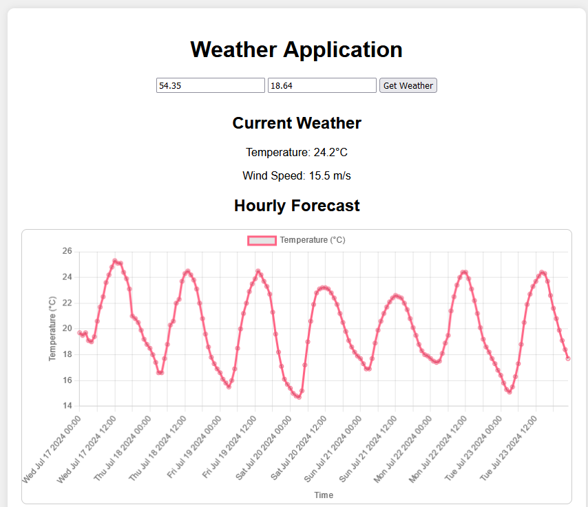

<p align="center">
  <a href="https://www.google.com/url?sa=i&url=https%3A%2F%2Fwww.freepik.com%2Fpremium-vector%2Fweather-infographic-line-climate-forecast-banner-with-rain-sunny-cold-day-elements-clouds-sky-moon-icons-precipitation-cloudiness-prediction-vector-meteorology-background_33099939.htm&psig=AOvVaw2MkwMPrTj5Qa60n1F8LWEi&ust=1721297430172000&source=images&cd=vfe&opi=89978449&ved=0CBEQjRxqFwoTCMjzn-HqrYcDFQAAAAAdAAAAABAE" 
target="blank"></a>
</p>

## Weather Application

This application is a web-based weather service that allows users to 
retrieve weather information based on geographic coordinates. 
It is built using the [NestJS framework](https://github.com/nestjs/nest), 
which provides a robust and scalable structure for server-side applications.

The application is deployed using Render and can be accessed at https://weather-application-uj94.onrender.com/.

## Features
- Fetch weather data based on latitude and longitude. 
- Handle various input validations and errors gracefully. 
- Display weather information on user-friendly charts.
- Display current weather information and forecast for the next days.



## Installation

```bash
$ npm install
```

## Running the app

```bash
# development
$ npm run start

# watch mode
$ npm run start:dev
```

## Test

```bash
# unit tests
$ npm run test
```

## Stay in touch

- Author - [Krzysztof Nazar](https://www.linkedin.com/in/krzysztofnazar/)

## License

Nest is [MIT licensed](LICENSE).
